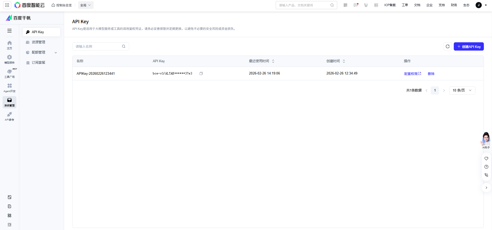
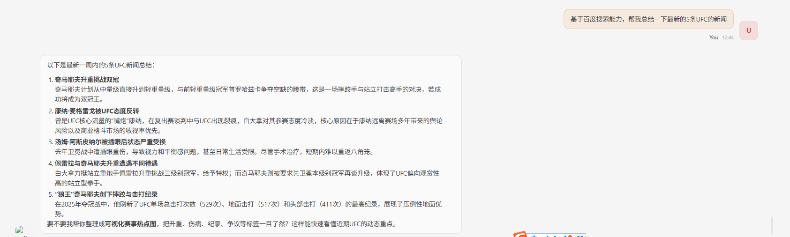

<!-- START doctoc generated TOC please keep comment here to allow auto update -->
<!-- DON'T EDIT THIS SECTION, INSTEAD RE-RUN doctoc TO UPDATE -->
**Table of Contents**  *generated with [DocToc](https://github.com/thlorenz/doctoc)*

- [openclaw 安装](#openclaw-%E5%AE%89%E8%A3%85)
  - [关于模型配置](#%E5%85%B3%E4%BA%8E%E6%A8%A1%E5%9E%8B%E9%85%8D%E7%BD%AE)
- [openclaw安装百度搜索的skill](#openclaw%E5%AE%89%E8%A3%85%E7%99%BE%E5%BA%A6%E6%90%9C%E7%B4%A2%E7%9A%84skill)
  - [如何安装skill](#%E5%A6%82%E4%BD%95%E5%AE%89%E8%A3%85skill)
  - [配置使用百度搜索能力](#%E9%85%8D%E7%BD%AE%E4%BD%BF%E7%94%A8%E7%99%BE%E5%BA%A6%E6%90%9C%E7%B4%A2%E8%83%BD%E5%8A%9B)
  - [openclaw中使用百度搜索的能力](#openclaw%E4%B8%AD%E4%BD%BF%E7%94%A8%E7%99%BE%E5%BA%A6%E6%90%9C%E7%B4%A2%E7%9A%84%E8%83%BD%E5%8A%9B)
- [操作浏览器](#%E6%93%8D%E4%BD%9C%E6%B5%8F%E8%A7%88%E5%99%A8)
- [参考](#%E5%8F%82%E8%80%83)

<!-- END doctoc generated TOC please keep comment here to allow auto update -->

# openclaw 安装
- 安装 OpenClaw：npm install -g openclaw@latest
- 新手引导并安装服务：openclaw onboard --install-daemon
- 运行：openclaw gateway start/stop/restart

## 关于模型配置
- 如果模型参数没有配对的话，会导致没办法正常响应对话
- 我这里是用的公司内部的copilot代理的配置和key

# openclaw安装百度搜索的skill
- 背景：因为openclaw的问题解答，无法联网搜索，需要使用brave之类的，对国人不太友好，网上搜索之后，有推荐用百度千帆的搜索api的.

## 如何安装skill
- 以下技巧都可以在openclaw官网中找到
- 安装clawhub：npm i -g clawhub
- 基于clawhub，安装仓库中的skill:clawhub install baidu-search
- 全部skill也可以在官网中阅读获取：https://clawhub.ai/skills?sort=downloads

## 配置使用百度搜索能力
- 安装之后，发现并不能有效使用，是因为这个skill需要解决一些依赖
- 依赖查询：https://github.com/openclaw/skills/blob/main/skills/ide-rea/baidu-search/SKILL.md
- python3和依赖的python模块（手动执行skill中的指令会知道）
- 配置百度的key（注册百度开发者、以及创建秘钥，入口较深）
[apikey创建地址](https://console.bce.baidu.com/qianfan/ais/console/apiKey)

## openclaw中使用百度搜索的能力

- 这里openclaw就有一个基本的联网搜索的能力了.

# 操作浏览器

# 参考
- [openclaw官网](https://docs.openclaw.ai/zh-CN)