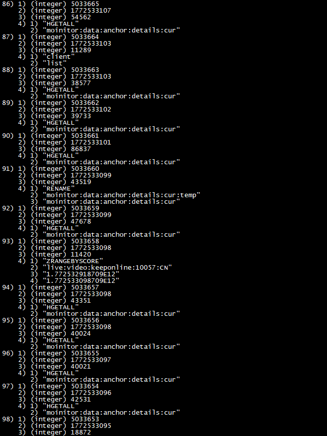
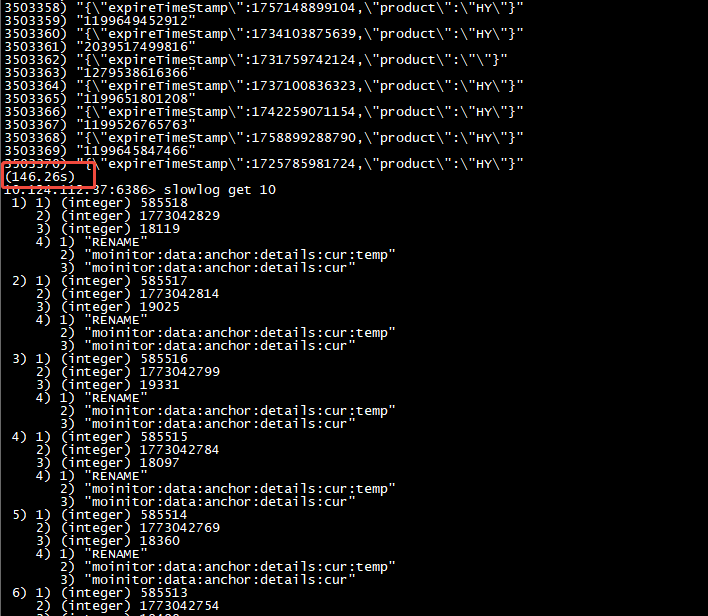

- [问题](#%E9%97%AE%E9%A2%98)
  - [分析过程](#%E5%88%86%E6%9E%90%E8%BF%87%E7%A8%8B)
    - [优化一：hgetall改为hscan](#%E4%BC%98%E5%8C%96%E4%B8%80hgetall%E6%94%B9%E4%B8%BAhscan)
    - [优化二：利用经验找到可疑key](#%E4%BC%98%E5%8C%96%E4%BA%8C%E5%88%A9%E7%94%A8%E7%BB%8F%E9%AA%8C%E6%89%BE%E5%88%B0%E5%8F%AF%E7%96%91key)
    - [影响分析元素](#%E5%BD%B1%E5%93%8D%E5%88%86%E6%9E%90%E5%85%83%E7%B4%A0)
  - [结论](#%E7%BB%93%E8%AE%BA)

# 问题

- 在发布服务A的时候，服务B出现了超时告警
- 需要找到超时的原因

## 分析过程

- 首先结合服务B的接口的超时日志，发现超时原因是因为服务B从jedis连接池中获取连接超时了（1s超时）
- 获取连接超时，找到DBA，DBA给了一个慢查询的截图 

### 优化一：hgetall改为hscan

- 猜测怀疑到key：moinitor:data:anchor:details:cur，但是这个key只有40ms+的耗时，结合经验，感觉不像这里导致；
- 这个key是hashmap类型，有1万+主播数据，用hgetall会导致40ms+的耗时
- 而redis svr的命令执行是单线程执行（即使高版本依然是），所以可能会阻塞其他命令执行.
- 将hgetall的用法优化为了hscan，但是发现问题依然存在
- 并且redis client和svr端的监控存在误差，客户端的耗时是300ms+，redis svr的慢日志是40ms+

### 优化二：利用经验找到可疑key

- 这里的思路应该将问题定义到是redis svr卡住
- 通过启动时候的hget请求变多，发现是另外一个key的内存缓存加载逻辑
- 将hget改为了普通的get操作，但是问题仍然存在
- 这个时候，已经注意到这个key的元素是特别多，并且没有设置过期，有174万+元素
- 观察代码引用，发现服务启动，会去读取这个数据，加载到内存
- 将问题反馈给DBA，dba验证下，发现加载数据要146s 
- 这样就完美解释了问题，这个大key的hgetall操作，会卡住redis svr2分钟，从而导致调用超时

### 影响分析元素

- DBA没有给出有效线索，redis svr的版本过低，没有记录到有效的慢日志log，另外记录的耗时是执行耗时（不包括排队耗时）
- 服务B访问redis没有监控，不知道耗时变化

## 结论

- 服务A启动的时候，执行了hash 大key的hgetall操作，从而卡住了redis svr，导致其他依赖这个redis的服务被调超时
- 查询这种问题，要有一些redis svr慢查询的一些经验