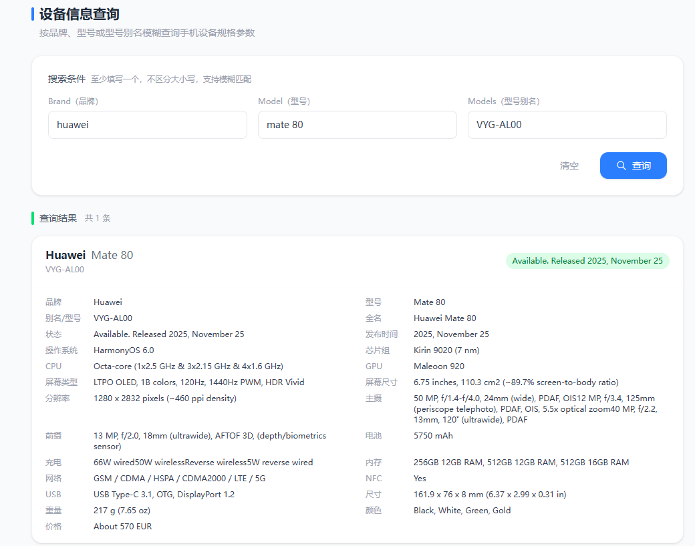

# 设备库是什么
- 设备库是可以通过手机型号等信息去查询设备的详情信息的一个能力.

# 为什么要用设备库
- 作用一：设备画像之参数不一致，比如分辨率、电量等，作为改机等维度的额外召回补充
- 作用二：设备画像之老旧设备，比如发布时间过久的设备就可以认为是老旧设备，老旧设备可能会被黑灰产拿来刷观时啥的
- 作用三：设备画像之高低价值，根据发行的价格或者配置参数，决定设备的价值画像
- 作用四：端上是拿不到手机的型号的，需要通过设备库映射到手机的具体型号，可以用来推荐手机壳等

# 怎么建立设备库
- 过程：爬虫 --> 写文件 --> 读取数据到mysql  --> 读取数据处理
- 爬虫的数据源：https://www.gsmarena.com/，这里有一些人机验证，需要自行解决
- 建表语句：https://github.com/walkertest/deviceinfo/blob/main/device_info.sql
- 具体执行逻辑，用AI生成即可
- 具体数据可以参考仓库：https://github.com/walkertest/deviceinfo
- 查询效果 
